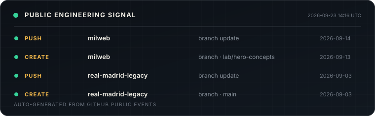

# Rick JS

**Engenheiro full-stack construindo sistemas do domínio à produção.**  
Full-stack engineer building systems from domain model to production.

 

  

[Trabalho / Work](#sistemas-selecionados--selected-systems) ·
[Atividade / Activity](#sinal-público--public-signal) ·
[MilWeb](https://milweb.com.br)

---

Gosto de transformar regras de negócio confusas em **domínios explícitos, fluxos confiáveis e software que continua compreensível conforme cresce**.

I enjoy turning messy business rules into **explicit domains, reliable flows and software that remains understandable as it grows**.

<table width="100%">
<tr>
<td width="33%" valign="top">

### Arquitetura  
Architecture

Clean Architecture  
Monólitos modulares  
Modelagem de domínio  
Monorepos

</td>
<td width="33%" valign="top">

### Plataforma  
Platform

APIs REST  
Realtime  
Filas e workers  
Web + mobile

</td>
<td width="33%" valign="top">

### Confiabilidade  
Reliability

Multi-tenancy e RLS  
Testes automatizados  
Observabilidade  
Segurança por design

</td>
</tr>
</table>

## Sinal público / Public signal

Este card é gerado diariamente a partir da atividade pública do GitHub. Nenhum contador manual.  
This card is generated daily from public GitHub activity. No manually entered metrics.

### Atividade recente / Recent activity

<!--START_SECTION:activity-->
- `PUSH` [milweb](https://github.com/rickjs2005/milweb) — branch update · 2026-09-05
- `PUSH` [real-madrid-legacy](https://github.com/rickjs2005/real-madrid-legacy) — branch update · 2026-09-03
- `CREATE` [real-madrid-legacy](https://github.com/rickjs2005/real-madrid-legacy) — branch · main · 2026-09-03
- `PUSH` [millead](https://github.com/rickjs2005/millead) — branch update · 2026-09-02
- `PUSH` [terral](https://github.com/rickjs2005/terral) — branch update · 2026-09-02
<!--END_SECTION:activity-->

## Sistemas selecionados / Selected systems

<table width="100%">
<tr>
<td width="50%" valign="top">

### [MilLead →](https://github.com/rickjs2005/millead)

**CRM e plataforma operacional**  
CRM and operations platform

`modular monolith` `multi-tenant` `jobs`

Next.js · Node.js · Express · PostgreSQL · Prisma · pg-boss

Regras comerciais, contratos, financeiro, projetos e automações pós-venda organizadas em domínio, aplicação e infraestrutura.

Commercial workflows, contracts, finance, projects and post-sale automation separated into domain, application and infrastructure.

</td>
<td width="50%" valign="top">

### [Milsaca →](https://github.com/rickjs2005/milsaca)

**SaaS de corretagem de café**  
Coffee brokerage SaaS

`web + mobile` `RLS` `realtime`

Next.js · Expo · Supabase · PostgreSQL 17 · Turborepo

Produto multi-tenant para produtores, corretoras e administradores, incluindo classificação COB, cotações, contratos e entregas.

Multi-tenant product for producers, brokers and admins, including COB classification, quotations, contracts and deliveries.

</td>
</tr>
<tr>
<td width="50%" valign="top">

### [InkVision →](https://github.com/rickjs2005/inkvision)

**Plataforma multi-tenant para estúdios**  
Multi-tenant studio platform

`domain core` `realtime` `state machine`

Prisma · PostgreSQL · Redis · BullMQ · Socket.IO · Stripe

Casos de uso independentes de framework, autorização contextual, pedidos com máquina de estados, chat e processamento assíncrono.

Framework-independent use cases, contextual authorization, order state machine, realtime chat and async processing.

</td>
<td width="50%" valign="top">

### [Kavita Platform →](https://github.com/rickjs2005/ecommerce-do-agro-backend)

**Plataforma de comércio e conteúdo**  
Commerce and content platform

`REST API` `security` `testing`

Node.js · Express · MySQL · Redis · Jest · Supertest

API em camadas com autenticação HttpOnly, CSRF, rate limiting, migrations, Swagger, testes e [frontend Next.js](https://github.com/rickjs2005/ecommerce-do-agro-frontend).

Layered API with HttpOnly authentication, CSRF, rate limiting, migrations, Swagger, tests and a separate Next.js frontend.

</td>
</tr>
</table>

## Fora da caixa / Outside the box

**[Aurex Motors](https://github.com/rickjs2005/aurex-motors)** é um experimento de creative engineering: um automóvel procedural renderizado em Three.js e React Three Fiber, com animação dirigida por um modelo mutável fora do ciclo de renderização do React.

**Aurex Motors** is a creative engineering experiment: a procedural vehicle rendered with Three.js and React Three Fiber, driven by a mutable world model outside React's render cycle.

---

**Construir, medir, aprender, simplificar.**  
Build, measure, learn, simplify.

  

[Website](https://milweb.com.br) · [Repositories](https://github.com/rickjs2005?tab=repositories)

