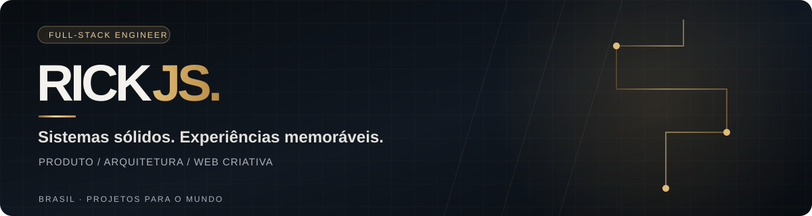

 

**Engenheiro full-stack · fundador da [MilWeb](https://milweb.com.br)**

Construo produtos digitais de ponta a ponta: domínio, API, interface e experiência.  
Full-stack engineer building digital products from domain model to interface and experience.

  

---

### O que eu construo / What I build

<table>
<tr>
<td width="50%" valign="top">

**01 / Produtos e plataformas**

SaaS, operações comerciais, e-commerce e ferramentas com regras de negócio reais. Trabalho com modelagem de domínio, APIs, dados, autenticação e fluxos confiáveis.

</td>
<td width="50%" valign="top">

**02 / Web que se destaca**

Sites e experiências com direção visual, movimento e atenção à performance. Interface e engenharia caminham juntas — do conceito ao deploy.

</td>
</tr>
</table>

`TypeScript` · `Next.js` · `React` · `Node.js` · `PostgreSQL` · `Three.js` · `GSAP`

## Projetos em destaque / Featured work

<table>
<tr>
<td width="50%" valign="top">

### [MilWeb ↗](https://milweb.com.br)
**Meu estúdio e portfólio**

Sites, landing pages e sistemas web sob medida, com direção visual, animação e conteúdo em português, inglês e espanhol.

`Next.js` `React` `TypeScript` `GSAP`

[Ver site →](https://milweb.com.br) · [Explorar código →](https://github.com/rickjs2005/milweb)

</td>
<td width="50%" valign="top">

### [Terral ↗](https://terral-delta.vercel.app/)
**Conceito visual para uma marca de café**

Da montanha à xícara: cinco capítulos com vídeo, conteúdo editorial e movimento guiado pela rolagem. Projeto fictício de portfólio.

`Next.js` `Three.js` `GSAP` `Lenis`

[Ver demo →](https://terral-delta.vercel.app/) · [Explorar código →](https://github.com/rickjs2005/terral)

</td>
</tr>
<tr>
<td width="50%" valign="top">

### [MilLead ↗](https://github.com/rickjs2005/millead)
**CRM e operação da MilWeb**

Da prospecção ao pós-venda: leads, pipeline, contratos, projetos e automações em um monólito modular multi-tenant.

`Next.js` `Node.js` `PostgreSQL` `Prisma`

[Explorar código →](https://github.com/rickjs2005/millead)

</td>
<td width="50%" valign="top">

### [Milsaca ↗](https://github.com/rickjs2005/milsaca)
**Tecnologia para a cadeia do café**

Produto web e mobile para produtores, corretoras e administração: cotações, classificação, contratos e entregas.

`Next.js` `Expo` `Supabase` `Turborepo`

[Explorar código →](https://github.com/rickjs2005/milsaca)

</td>
</tr>
<tr>
<td width="50%" valign="top">

### [InkVision ↗](https://github.com/rickjs2005/inkvision)
**Plataforma para estúdios de tatuagem**

Descoberta de artistas, pedidos, orçamento, chat e simulação de arte. Domínio, estados e trabalho assíncrono organizados em camadas.

`PostgreSQL` `Redis` `Socket.IO` `BullMQ`

[Explorar código →](https://github.com/rickjs2005/inkvision)

</td>
<td width="50%" valign="top">

### [Kavita Platform ↗](https://github.com/rickjs2005/ecommerce-do-agro-backend)
**Comércio e conteúdo para o agro**

API com autenticação, segurança, documentação e testes, conectada a um [frontend Next.js](https://github.com/rickjs2005/ecommerce-do-agro-frontend).

`Node.js` `Express` `MySQL` `Jest`

[Backend →](https://github.com/rickjs2005/ecommerce-do-agro-backend) · [Frontend →](https://github.com/rickjs2005/ecommerce-do-agro-frontend)

</td>
</tr>
</table>

## Engenharia criativa / Creative engineering

| Projeto | Experiência | Código |
| :--- | :--- | :--- |
| **Aurex Motors** | Modelo 3D em GLB, materiais configuráveis e câmera guiada pelo scroll | [Ver projeto ↗](https://github.com/rickjs2005/aurex-motors) |
| **Atelier Vertex** | Arquitetura fictícia com vídeo controlado pelo scroll | [Ver projeto ↗](https://github.com/rickjs2005/atelier-vertex-v2) |

## Atividade pública / Public activity

A atividade abaixo considera eventos públicos e pode não refletir o trabalho em repositórios privados. / Public events do not represent work in private repositories.

<!--START_SECTION:activity-->
- `PUSH` [milweb](https://github.com/rickjs2005/milweb) — branch update · 2026-09-25
- `PUSH` [rpg-mobile](https://github.com/rickjs2005/rpg-mobile) — branch update · 2026-09-25
- `PUSH` [nexus-geek-store](https://github.com/rickjs2005/nexus-geek-store) — branch update · 2026-09-25
- `PUSH` [spiderman-bnd](https://github.com/rickjs2005/spiderman-bnd) — branch update · 2026-09-25
- `PUSH` [alva-odontologia](https://github.com/rickjs2005/alva-odontologia) — branch update · 2026-09-25
<!--END_SECTION:activity-->

---

**Tem um projeto em mente?** [Veja meu trabalho e entre em contato pela MilWeb ↗](https://milweb.com.br)

Construir, medir, aprender, simplificar. / Build, measure, learn, simplify.

