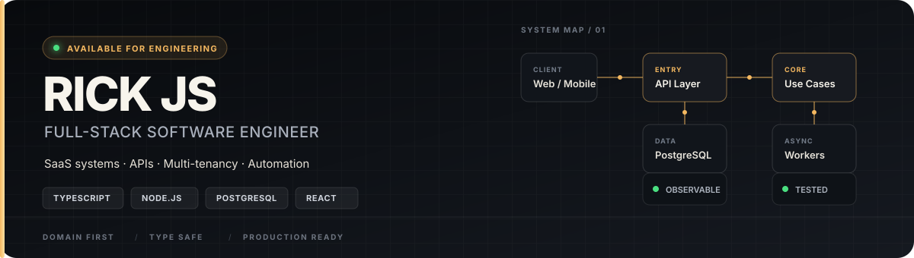

<div align="center">

`SYSTEM DESIGN` · `BACKEND` · `FULL-STACK` · `PRODUCT ENGINEERING`

</div>

## 01 — Profile

I build software from the **domain model to production**: architecture, database design, APIs, frontend, asynchronous processing, tests, security and observability.

```ts
const engineeringFocus = {
  architecture: ["Clean Architecture", "Modular Monolith", "Multi-tenancy"],
  systems: ["SaaS", "REST APIs", "Realtime", "Workers & Queues"],
  priorities: ["Correctness", "Maintainability", "Performance", "Security"],
} as const;
```

My strongest work sits at the intersection of product and engineering: translating business rules into well-defined domains, reliable data flows and software that can evolve without becoming fragile.

## 02 — Core systems

<table>
<tr>
<td width="50%" valign="top">

### [MilLead](https://github.com/rickjs2005/millead)

**CRM and operations platform**

`CLEAN ARCHITECTURE` `MULTI-TENANT` `JOBS`

Modular monolith with Next.js, Node.js, Express, PostgreSQL and Prisma. Covers leads, pipeline, contracts, finance, projects and post-sale automation.

**Engineering:** domain/application/infrastructure boundaries, organization-scoped data and pg-boss queues.

</td>
<td width="50%" valign="top">

### [Milsaca](https://github.com/rickjs2005/milsaca)

**Coffee brokerage SaaS**

`WEB + MOBILE` `RLS` `REALTIME`

Turborepo with Next.js and Expo for producers, brokers and platform admins. Includes quotations, COB classification reports, contracts and deliveries.

**Engineering:** PostgreSQL 17, Supabase Auth, Row Level Security, Realtime and shared domain packages.

</td>
</tr>
<tr>
<td width="50%" valign="top">

### [InkVision](https://github.com/rickjs2005/inkvision)

**Multi-tenant studio platform**

`DOMAIN CORE` `REALTIME` `STATE MACHINE`

SaaS organized around framework-independent use cases and infrastructure ports. Supports orders, budgets, realtime chat, scheduling and payments.

**Engineering:** Prisma, PostgreSQL, Redis, BullMQ, Socket.IO, Stripe, R2-compatible storage and contextual authorization.

</td>
<td width="50%" valign="top">

### [Kavita Platform](https://github.com/rickjs2005/ecommerce-do-agro-backend)

**Commerce and content system**

`REST API` `SECURITY` `TESTING`

Node.js/Express API and a separate [Next.js frontend](https://github.com/rickjs2005/ecommerce-do-agro-frontend), with commerce, content, users, payments and administration.

**Engineering:** layered architecture, MySQL, Redis, Zod, HttpOnly auth, CSRF, rate limiting, Swagger, Jest, Supertest and Vitest.

</td>
</tr>
</table>

## 03 — Toolbox

<p>
  
  
  
  
  
  
  
  
</p>

| Architecture | Platform | Quality |
| --- | --- | --- |
| Clean Architecture | REST and Realtime | Automated tests |
| Modular monoliths | Workers and queues | Structured logging |
| Domain modeling | Web and mobile | Health checks |
| Multi-tenancy and RLS | External integrations | Security by design |

## 04 — Technical interests

```text
domain modeling       → rules that remain explicit
authorization         → tenant isolation and contextual access
async processing      → queues, retries and idempotency
realtime systems      → events, presence and messaging
observability         → logs, health checks and production signals
developer experience  → documentation, repeatable setup and safe migrations
```

## 05 — Creative engineering

Beyond application engineering, I explore realtime graphics and interaction. **[Aurex Motors](https://github.com/rickjs2005/aurex-motors)** renders a procedural vehicle with Three.js and React Three Fiber, using a mutable world model for animation without React re-renders.

---

<div align="center">

### Build systems, not just screens.

Full-stack engineering · Backend · Digital products

[**milweb.com.br**](https://milweb.com.br)

</div>
